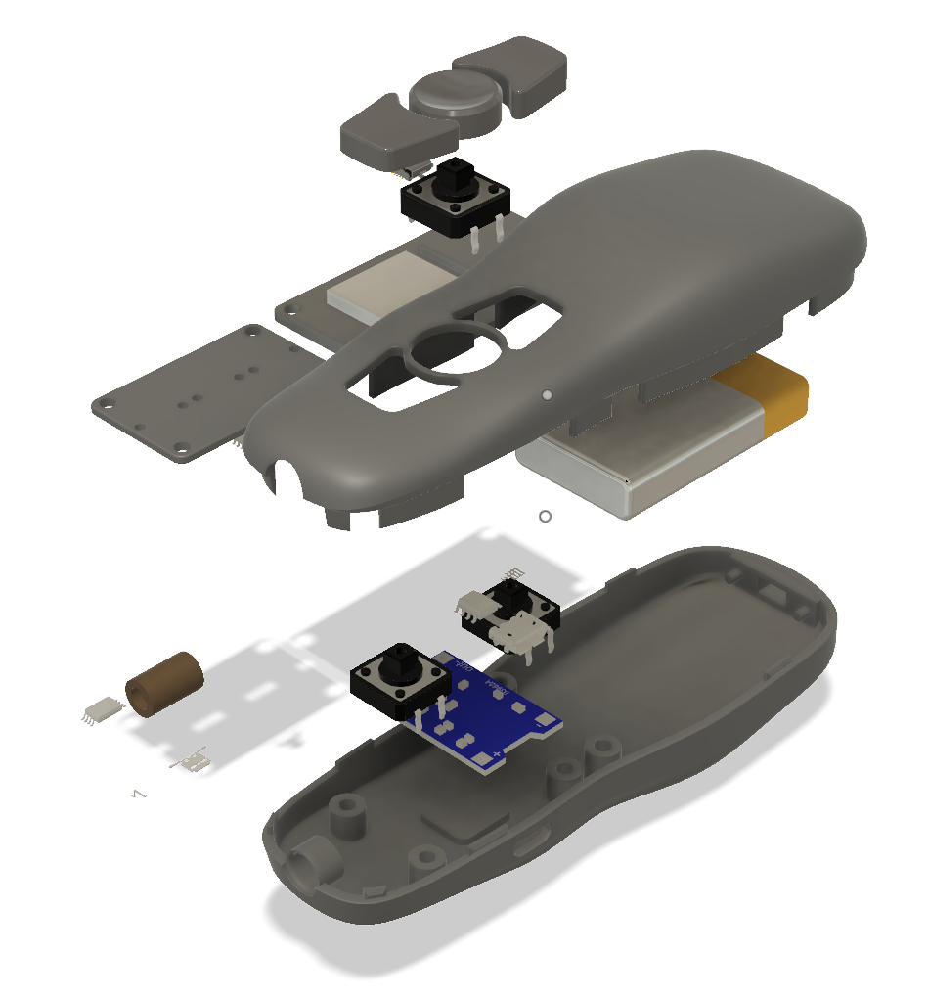

# esp32-keynotes-controller

An ESP32 based BLE Keynote remote controller.
Also known as `KeyLight`.

## Appearance

## BOM

- 3D Printed case and parts.
- [ESP32 Devkit v1](https://item.taobao.com/item.htm?spm=a1z09.2.0.0.76d12e8dVNq61T&id=563668634893&_u=e10f2ti56b4) x 1
- [3.7v LiPo Battery](https://item.taobao.com/item.htm?spm=a1z09.2.0.0.76d12e8dVNq61T&id=523205607530&_u=e10f2ti89d2) x 1
- [TP4056 LiPo Battery Charger Module](https://item.taobao.com/item.htm?spm=a1z09.2.0.0.76d12e8dVNq61T&id=522583198103&_u=e10f2tid961) x 1
- [Switch](https://item.taobao.com/item.htm?spm=a1z09.2.0.0.76d12e8dVNq61T&id=522555847475&_u=e10f2ti034e) x 1
- [12 x 12 Buttons](https://item.taobao.com/item.htm?spm=a1z09.2.0.0.76d12e8dVNq61T&id=566514301427&_u=e10f2tie2b7) x 3
- [Laser Emitter](https://item.taobao.com/item.htm?spm=a1z09.2.0.0.76d12e8dVNq61T&id=522576364570&_u=e10f2tidee6) x 1 (optional)
